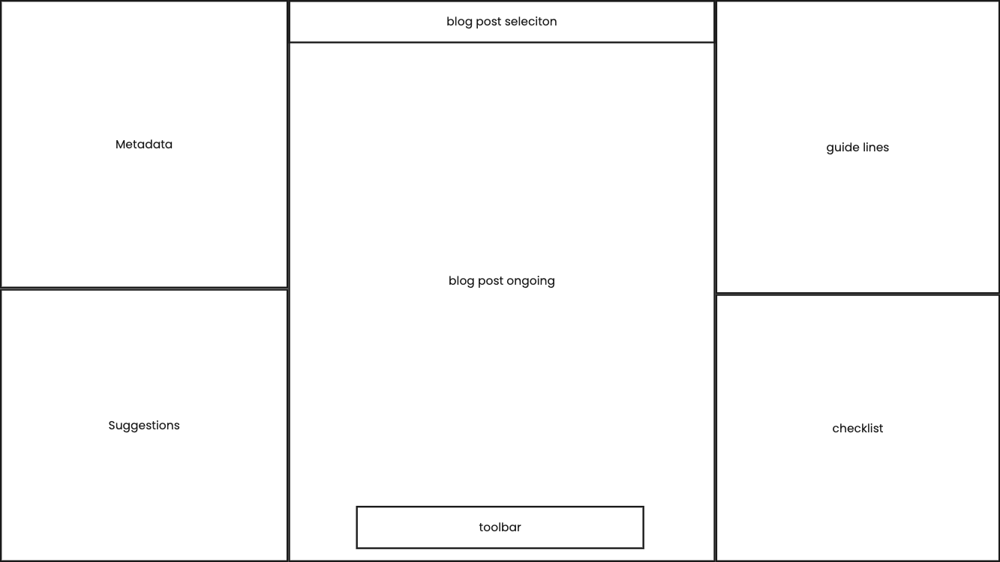

# Overview

Web application to review a text writing against a set of guidelines and checklist.

## Features

### Guidelines

Guidelines are a markdown list that is used by the agent to review the text content, for example a blog post, and highlights the text content parts which are against the guidelines rules.

- Click: If the user over a guideline single item, the text that is against that guideline is highlighted in the text central area.Similarly, if the user over the parts of the text star that is highlighted, the corresponding guideline is highlighted as well.

### Checklist

Checklist is a markdown checkboxes list that the content text must address to. If the text content correctly addresses items in the checkboxes, they will be checked.

### Suggestions

Suggestions is an output area where the assistant messages are written to be read by the user. The goal is to provide the user agent assistant suggestion based on the result of the analysis processes against the checklist and the guidelines.

### Metadata

Metadata are data structured that are related to the text content. For example, they can be used to add more information other than the content. For example, tags, creation date, etc. These can be used by the assistant or just as information from the user.

### Toolbar

The toolbar is a set of actions that the user can interact with to start the agent processes, such as the analyzation against the checklist and the guidelines.

## Wireframe

